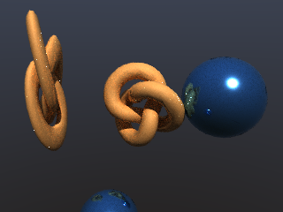

# Path tracing for Nanite on three.js WebGPU

Real-time path tracing of the [Nanite-style cluster pipeline](https://github.com/miguelmyers8/Nanite)
(three.js r185 `WebGPURenderer`, TSL compute), tracing the same clusters,
the same LOD cut and the same materials the rasterizer draws, with no
hardware ray tracing and no per-frame build over the geometry or the cut (a small
BVH over the instances is rebuilt each frame).



| Stage | Status | Debugger |
| --- | --- | --- |
| 1. Acceleration structures: triangle BVH per cluster, a hierarchy per mesh over every LOD level with the error bounds a ray prunes with, a per-frame instance TLAS, packed layouts, CPU reference traversal | done | `test/core.test.mjs` |
| 2. The tracer: trace and shade compute kernels (camera rays, the cut chosen in the traversal, sun shadow rays, GGX + Lambert, hemisphere sky, progressive accumulation), display with debug views | done | `examples/pathtrace-debugger/` |
| 3. Headless validation on SwiftShader: GPU primary hits against the CPU twin (0 mismatches required), the random numbers, bounces, every view, the debugger's own checks | done | `npm run gpu-test` |
| 4. Packaging as a claude.ai Artifact: one self-contained folder, built and checked by a script | done | `npm run build:artifact` |

## The two questions this project started with

**Does three-gpu-pathtracer work with WebGPURenderer?** Yes, since v0.0.25
(2026-09-28): `WebGPUPathTracer` from `three-gpu-pathtracer/webgpu` runs on
three r185+ with the WebGPU backend; the old `WebGLPathTracer` is
deprecated. Details, versions and sources: `docs/research/01-three-gpu-pathtracer.md`.

**Build on it or build our own?** Our own traversal, on the pipeline's
own data. three-gpu-pathtracer builds its BVH on the CPU per geometry at
`setScene()` and treats geometry as static afterwards; a Nanite cut is a
different set of triangles every frame, chosen on the GPU, that the CPU
never sees. The one component that makes a Nanite path tracer is exactly
the one the library cannot supply, and its kernels are bound to
three-mesh-bvh's node layout. Everything else here is deliberately small
and can borrow from it later (wavefront queues, MIS, denoising). The
alternatives considered (a per-frame top level over the cut, a proxy mesh)
and the industry's answers (Unreal's fallback mesh, streamed-out BLAS and
RTX Mega Geometry; NVIDIA's cluster acceleration structures; Intel's
hierarchical-LOD ray tracing) are in `docs/research/02-path-tracing-nanite.md`.

## How it traces a cut without a per-frame build over the geometry

Every cluster of the Nanite set carries its own and its parent group's
bounding sphere and error, and the cull kernel draws a cluster when its own
projected error is at most the threshold and its parent's is above it. The
tracer keeps a **static hierarchy per mesh over all LOD levels** (one
sub-tree per level, joined at the top). Each node carries, besides its
geometry box, the subtree's largest parent error, smallest own error, the
box of the spheres those errors are measured against, and the largest parent
radius. A ray:

1. walks the TLAS over the instances (a small BVH the CPU rebuilds from the
   instance matrices each frame) and enters each hit instance's object space;
2. walks the mesh hierarchy with an explicit stack, skipping a subtree when
   its largest parent error projects at or below the threshold at the
   nearest possible distance (everything below is too fine: an ancestor's
   level covers it) or its smallest own error projects above the threshold
   at the farthest (everything below is too coarse);
3. at a cluster applies the cull kernel's exact rule, with the error
   projected from the camera for every ray, primary or bounced, so all rays
   see one crack-free surface and it is the rasterized one;
4. walks the cluster's own triangle BVH (built once, a software "CLAS") and
   reads triangles through the mesh's corner fetch, the decode the vertex
   stage, the software rasterizer and the resolve use.

The cull kernel's CPU reference (`lodSelected`) is called by the tracer's
CPU twin, and the tracer's GPU kernel evaluates the same expressions, so the
three agree: the test suite compares the GPU's primary hits (instance,
cluster, triangle) with the CPU's on every pixel of a 96 × 72 frame, and the
debugger on 3,072 sampled rays, and requires no mismatch (none is measured; a
matrix whose columns are not orthogonal needs the singular-value bounds the
TLAS record carries, and has its own regression test).

## Usage

```js
import { buildLodMeshletSetFromGeometry, MeshletMesh, MeshletScene, MaterialTable } from 'nanite/meshlets/index.js';
import { PathTracePass, PathTraceView, maxFramePixels } from 'nanite-path-tracing';

const scene = new MeshletScene( sets, { maxInstances: 256 } );        // or one MeshletMesh of one set
const mesh = new MeshletMesh( scene.set, { scene, materials } );       // the raster's mesh: its buffers are read as they are
// the frame is nine vec4 per pixel (144 bytes): maxPixels scales a request down to what the device's buffers hold (about 930 000
// pixels at WebGPU's default limits; ask the adapter for more in the device's requiredLimits, as the debugger does)
const tracer = new PathTracePass( mesh, width, height, { materials, maxBounces: 3, maxPixels: maxFramePixels( renderer.backend.device ) } );

function frame() {
	tracer.setViewport( camera, heightPixels );   // the cull kernel's pixel scale: the same cut as the raster
	tracer.lodThreshold = 1;                      // pixels of projected error
	tracer.execute( renderer, camera );           // TLAS refresh, then per bounce the trace and shade kernels
	tracer.render( renderer );                    // the accumulated image on a full-screen quad (tracer.split: pixels that keep the raster)
}
```

`tracer.view` selects `PathTraceView.PATH` or a debug view drawn from the
primary hit record (NORMAL, CLUSTER with the raster's cluster colours, LEVEL,
INSTANCE, TRIANGLE, ALBEDO, COST; the debug views trace the pixel centre).
Moving the camera, resizing, and changing the tracer's own settings (view,
bounces, LOD threshold, sun size, back-face culling) restart the accumulation;
**call `tracer.reset()` after changing instance matrices, the light or the
materials**, which the tracer cannot see change. `samplesPerFrame` and
`maxBounces` trade speed for convergence. The tracer shares the mesh's
lighting uniforms (sun direction and colour, sky and ground colours) and
keeps the raster's light convention: a Lambert surface facing the sun returns
`albedo × lightColor`, and the hemisphere sky is the environment.

Core, no three.js (`src/core/`, runs in Node): `buildAccel( set )` builds
and packs the cluster BVHs and hierarchies; `buildInstanceTlas( ... )` the
instance TLAS; `traceRay( ctx, origin, direction, lod )` is the CPU twin of
the kernel's traversal (`traceRayBruteForce` the brute force over the cut,
for tests); `cameraRay` the kernel's camera ray.

Storage buffers per kernel stay within WebGPU's guaranteed eight: accel,
tlas, frame (colour sums, the primary hit record, the path state), and the
mesh's meta, vertices, triangles, vertexData. Paged (compressed) and chunked
(camera-relative) meshes are not supported yet.

## The Nanite repository

The pipeline is a package dependency pinned to a commit of its repository,
the way the Nanite repository pins its own SpatialPrimitives dependency:

```json
"dependencies": { "nanite": "git+https://github.com/miguelmyers8/Nanite.git#<commit>" }
```

`npm install` fetches it into `node_modules/nanite`; this package's own `exports` map `.` to `src/index.js`, `./core` to the dependency-free core and `./*` to `src/*`, which is what the `nanite-path-tracing/` specifier of the pages' import maps names. The pages map
`nanite/` to `node_modules/nanite/src/` in their import map and the code
imports `nanite/meshlets/index.js` (the three.js layer) and
`nanite/meshlets/core.js` (dependency-free). The pinned commit adds a
wildcard to Nanite's package exports so those specifiers resolve in Node as
they do in the browser; bump the commit hash to follow the pipeline. For
local development against a checkout, `npm link` or a symlink at
`node_modules/nanite` works the same way.

## Running

```sh
npm install          # three@0.185.0 and the Nanite pipeline
npm test             # node --test: the builders, the packed layouts, the CPU traversal against the brute force
npm run dev          # static server on :8080, open /examples/pathtrace-debugger/
npm run gpu-test     # headless Chrome with WebGPU through SwiftShader: the kernels against the CPU twin (needs playwright)
npm run build:artifact   # dist/pathtrace-debugger: the debugger as a self-contained folder for a claude.ai Artifact
npm run test:artifact    # build it, then run the built page's own checks
```

The debugger (`examples/pathtrace-debugger/`) shows the raster pipeline's
frame and the path traced frame split across the viewport, with the LOD
threshold, bounces, samples per frame, resolution scale, sun size, the
debug views and a "verify" button that reads the primary hit record back
and compares it with the CPU reference. WebGPU needs Chrome or Edge; there
is no WebGL fallback.

`npm run gpu-test` runs `scripts/gpu-harness.mjs`: it launches a Chromium
with `--enable-unsafe-webgpu --use-webgpu-adapter=swiftshader`, connects
Playwright over CDP, serves the pinned three.js CDN URLs from
`node_modules`, renders into render targets (SwiftShader has no canvas
swap chain) and reads each page's verdict. It needs the `playwright`
package (a local devDependency or a global install; `PLAYWRIGHT_MODULE` and
`CHROME_PATH` override the lookup) and Playwright's Chromium. A failing run
writes the WGSL of every shader module to `test/.tmp/shaders/`.

## Research

- `docs/research/01-three-gpu-pathtracer.md`: the library on
  WebGPURenderer, what it can and cannot trace, the build-on versus
  build-own decision.
- `docs/research/02-path-tracing-nanite.md`: Unreal's three generations of
  Nanite ray tracing, RTX Mega Geometry and cluster acceleration structures,
  the research literature, WebGPU's constraints, the architectures compared,
  the design chosen and the lessons from building it.
- `docs/research/03-status.md`: what is done, what is open, and what a
  production tracer would add.
